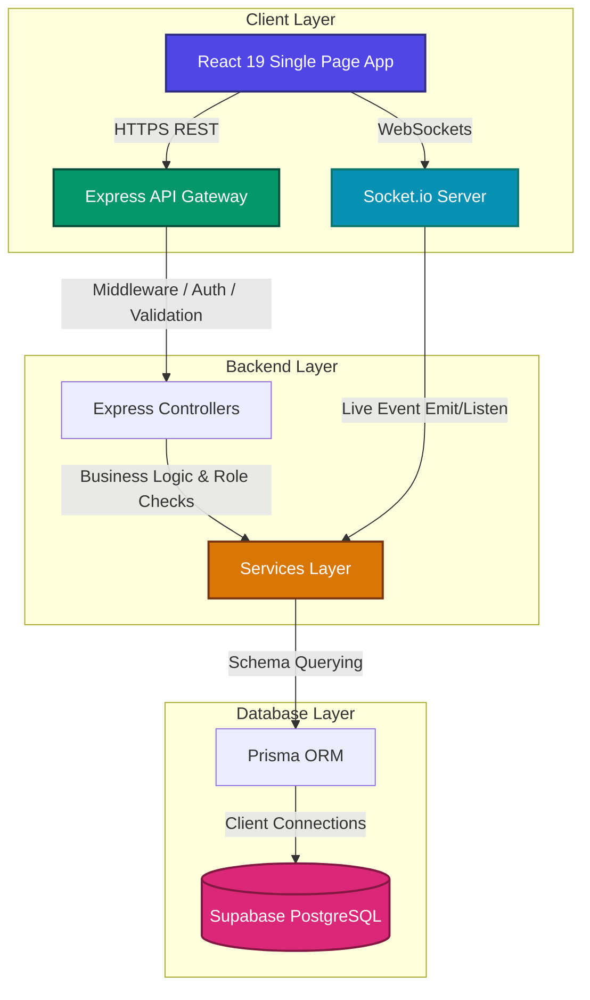
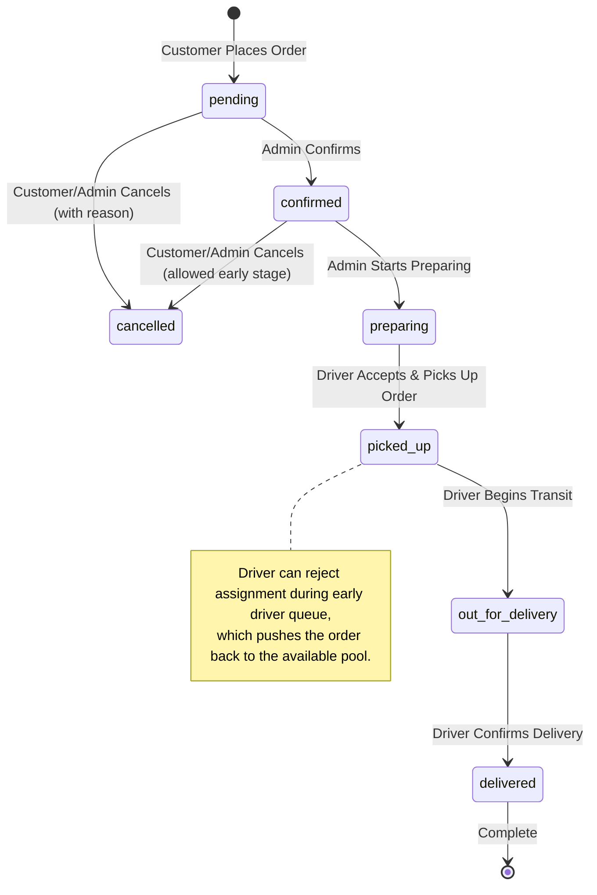

# 🚀 Yumzo - Production-Ready Food Delivery Platform

**Yumzo** is a complete, multi-role food delivery platform engineered with a robust backend using **Node.js, Express, Prisma, and PostgreSQL** (hosted on Supabase) and a highly responsive, modern frontend using **React 19, Vite, and Tailwind CSS v4**.

Unlike typical simple CRUD applications, Yumzo simulates realistic, operational logistically-driven workflows. It manages strict order status transition rules, role-specific dashboard access levels, real-time client-server communication using WebSockets, GPS-assisted checkout, and collaborative group ordering rooms.

---

## 🏗️ System Architecture & Data Flow

### Technical Stack & Service Layering
Yumzo is designed with a strict separation of concerns, utilizing the **Route-Controller-Service** architectural pattern on the backend to isolate business logic, validation layers, database access, and routing.



### End-to-End Order Lifecycle Flow
An order transitions through a logical, role-bounded lifecycle where status changes are restricted to authorized accounts:



### 🔑 Client-Side Authentication & Session Flow
1. **User Sign-up / Login**: Customers and drivers submit their credentials via the UI.
2. **JWT Storage**: Upon successful authentication, the server returns an access token and a refresh token. The access token is securely stored in client-side memory/context, while basic session markers are cached in `localStorage`.
3. **Axios Interceptors**: Outgoing REST API requests automatically attach the token inside the `Authorization: Bearer <token>` header.
4. **Navigation Guarding**: Client-side protected routes check token validity and user roles. Unauthenticated sessions are automatically intercepted and redirected to `/login` (for customers) or `/driver/login` (for drivers).

---

## 🌟 Core Personas & Detailed Features

### 👤 Customer Persona
*   **Restaurant & Menu Browsing**: Sleek grids of local eateries with tag filtering (Cuisine, Veg/Non-Veg) and item-level details.
*   **Interactive Shopping Cart**: Persisted, real-time updated cart count with instant modifications.
*   **Dual Address Options**: Supports manually saved delivery addresses with default flags, or 1-click browser-based GPS coordinate capture.
*   **Rating & Reviews System**: Allows customers to submit a 1-to-5 star rating and feedback text (restricted to one review per user per restaurant), which dynamically updates the restaurant's average rating.
*   **Smart Combo/Diet Planner**: Goal-based combo suggestions (e.g., "High Protein", "Low Budget") calculated by backend menu analyzers.
*   **Collaborative Group Ordering**: Live room creation using shareable join codes, enabling multiple users to add items to a shared cart with host-only checkout control and split-bill summary views.
*   **Interactive Delivery Tracking**: Real-time polling updates on the order progression with fallback map visualization of the destination.
*   **Food Reels Feed**: Visual scrollable food videos (Reels) with interactive Like and Comment components.

### 🚴 Driver Persona
*   **Dedicated Driver Entrance**: Separate auth pipeline with specific driver dashboards.
*   **Available Orders Queue**: Real-time listing of confirmed orders awaiting driver pickup.
*   **Assignment Controls**: Options to accept an order or reject it (capturing a rejection reason and returning the order to the queue).
*   **In-Transit GPS Updating**: Active background location emitter updates coordinate state for live client tracking.
*   **Navigation Shortcuts**: 1-click mobile map application launch support via platform-specific deep links with web fallback.
*   **Order Delivery Timeline**: Update steps from `preparing` ➡️ `picked_up` ➡️ `out_for_delivery` ➡️ `delivered`.

### 👑 Admin / Restaurant Owner Persona
*   **Metrics & Operational Hub**: Comprehensive summary cards displaying total revenue, active orders count, and system performance.
*   **Restaurant CRUD Management**: Full capability to create, update, disable, or delete restaurant listings.
*   **Dynamic Menu Builder**: Create dishes, categories, set prices, mark veg/non-veg status, and toggle availability.
*   **Orders Oversight & Exceptions**: Process early-stage orders and manage manual cancellations, logging cancellation reasons into persistent order notes.

---

## 🛠️ Advanced Tech Stack

### Frontend
-   **React 19 & Vite**: Ultra-fast build toolchain and component-driven view layer.
-   **Tailwind CSS v4**: Modern, compiler-backed CSS system for modular, responsive layouts.
-   **React Router Dom**: Client-side layout boundaries and path-level dynamic imports.
-   **Axios**: Custom HTTP client with interceptor middleware for automated JWT headers.
-   **Socket.io Client**: Dedicated WebSocket listeners for instantaneous status updates.
-   **React Hot Toast**: Beautiful non-blocking notification alerts.

### Backend
-   **Node.js & Express**: High-concurrency runtime and routing engine.
-   **Prisma ORM**: Type-safe relational database client with clean migration scripts.
-   **Supabase PostgreSQL**: Scalable relational database cloud hosting.
-   **JSON Web Tokens (JWT) & BcryptJS**: Multi-stage authentication (access + refresh tokens) and salted password hashing.
-   **Express Validator**: Strict request schema verification middleware.
-   **Winston Logger**: Clean production logging with file-rotating systems.

---

## 🧠 Engineering Problems & Solutions

### 1. Legacy Database Schema Inconsistencies
*   **Challenge**: Connecting the app to an older database state led to errors because some rows had `NULL` values in columns that the new Prisma schemas marked as required (non-null).
*   **Solution**: Written custom SQL fallback queries and mapping checks inside controllers. Created a migration script `ensureLegacyDbCompatibility.js` that inspects rows and automatically sets defaults for legacy records.

### 2. Dev Rate-Limiter Bottlenecks
*   **Challenge**: Frequent API polling during driver location updates and order tracking hit global API rate limit constraints on local development servers, returning HTTP 429.
*   **Solution**: Re-configured the Express Rate Limiter to bypass/relax constraints specifically for `localhost` requests, while keeping production rules intact.

### 3. Client Polling Overhead & UI Jank
*   **Challenge**: Running constant background intervals to poll order statuses degraded browser tab performance.
*   **Solution**: Optimized client scripts to pause status polling if the user switches browser tabs (`document.visibilityState === 'hidden'`), saving network resources. Implemented route-level lazy loading to minimize first-paint assets.

### 4. Gmail-style Canonical Admin Security
*   **Challenge**: Ensuring admin roles remain secure while avoiding duplicate entries due to case differences or dots/pluses in Gmail.
*   **Solution**: Implemented an email canonicalization service that strips periods (`.`) and ignores plus signs (`+`) on Gmail handles, validating the resulting canonical email against the environment allowlist.

---

## 🔑 Database Models Structure

The PostgreSQL database contains the following core tables managed via `schema.prisma`:

*   `users`: Stores profile, role (customer/driver/admin), and credentials.
*   `addresses`: Customer-saved shipping locations (includes coordinate data).
*   `restaurants`: Venues, ratings, owners, and cities.
*   `menu_items`: Food dishes with categories, pricing, veg flags, and availability.
*   `orders` & `order_items`: Order states, customer links, driver references, and quantities.
*   `payments`: Logs payment status (mock, cash on delivery, card, upi) and Stripe Transaction references.
*   `reels`, `ReelLike`, & `ReelComment`: Social vertical feed engagement.
*   `GroupOrder`, `GroupOrderMember`, & `group_order_items`: Collaborative shopping rooms.

---

## 📡 API Directory Reference

### Authentication Namespace (`/api/auth`)
*   `POST /api/auth/signup`: Create a new customer or driver profile.
*   `POST /api/auth/login`: Authenticate and receive access/refresh tokens.
*   `GET /api/auth/me`: Fetch profile statistics of the active token.

### Customer Operations (`/api/user`)
*   `GET /api/user/restaurants`: List active restaurants (supports pagination).
*   `GET /api/user/restaurants/:id/menu`: Get menu items.
*   `GET/POST /api/user/restaurants/:id/reviews`: View/Submit ratings.
*   `POST /api/user/restaurants/:id/smart-combo`: Retrieve calorie/budget combo.
*   `GET/POST/PUT/DELETE /api/user/addresses`: Manage shipping profiles.
*   `GET/POST/PUT/DELETE /api/user/cart`: Read or modify items in cart.
*   `POST/GET /api/user/orders`: Place orders or check order history.
*   `GET /api/user/orders/:id/tracking`: Get status and coordinates.
*   `PATCH /api/user/orders/:id/cancel`: Cancel order (pending/confirmed only).
*   `POST /api/user/group-orders/rooms`: Create group order room.
*   `POST /api/user/group-orders/rooms/join`: Enter shared room.
*   `POST /api/user/payments/:orderId/stripe/create-intent`: Initiate Stripe.
*   `POST /api/user/payments/:orderId/mock`: Execute fallback mock payment.

### Driver Operations (`/api/driver`)
*   `POST /api/driver/login`: Authenticated driver dashboard entry.
*   `GET /api/driver/orders/available`: Retrieve open delivery queue.
*   `POST /api/driver/orders/:orderId/accept`: Take delivery task.
*   `POST /api/driver/orders/:orderId/reject`: Return task to available pool with reason.
*   `GET /api/driver/orders/assigned`: Check active assignments.
*   `PATCH /api/driver/orders/:orderId/status`: Update transit phase.
*   `PATCH /api/driver/orders/:orderId/location`: Push current GPS coordinates.

### Admin Operations (`/api/admin`)
*   `GET /api/admin/dashboard`: Fetch platform revenue, orders, and stats.
*   `GET/POST/PUT/DELETE /api/admin/restaurants`: Central restaurant management.
*   `GET/POST/PUT/DELETE /api/admin/menu`: Central menu pricing & dishes control.
*   `GET /api/admin/orders`: List all historical system orders.
*   `PATCH /api/admin/orders/:orderId/status`: Process order stage overrides.

---

## 🚀 Local Installation & Setup

### 1. Clone & Install Dependencies
Run the following at the root workspace directory to install root, backend, and frontend packages:
```bash
npm install
npm --prefix backend install
npm --prefix frontend install
```

### 2. Environment Configurations

#### Backend Environment (`backend/.env`)
Create `backend/.env` file:
```env
DATABASE_URL="postgresql://<user>:<password>@<host>:<port>/postgres?sslmode=require"
PORT=5000
JWT_SECRET="your_custom_jwt_access_token_secret"
JWT_EXPIRES_IN="7d"
JWT_REFRESH_SECRET="your_custom_jwt_refresh_token_secret"
JWT_REFRESH_EXPIRES_IN="30d"
ALLOWED_ORIGINS="http://localhost:5173"
ADMIN_EMAIL="yashchau.work@gmail.com"
```

#### Frontend Environment (`frontend/.env`)
Create `frontend/.env` file:
```env
VITE_API_URL="/api"
VITE_SOCKET_URL="http://localhost:5000"
```

### 3. Database Sync & Seed Data
Generate Prisma Client and push schemas to Supabase PostgreSQL:
```bash
# Generate database Client
npm --prefix backend run prisma:generate

# Push schema tables to database
npm --prefix backend run prisma:push

# Verify legacy compatibility
npm --prefix backend run db:compat

# Seed database with test restaurants, menus, and reels
npm --prefix backend run seed:demo
npm --prefix backend run seed:reels
```

### 4. Running Development Servers
You can launch both servers simultaneously using root-level npm scripts:

*   Run Backend: `npm run dev:backend`
*   Run Frontend: `npm run dev:frontend`

The application will be accessible at:
*   Frontend Client: `http://localhost:5173`
*   Backend REST API: `http://localhost:5000`
